[↩️ Volver al inicio](https://github.com/alexjhoan07-wq/Portafolio-Digital-de-Aprendizaje-Teoria-de-la-Programacion/blob/main/Portafolio.md)
<div align="center">   

# Unidad 2 – Estructuras algorítmicas de control


[](https://img.shields.io/badge/Estructuras-Condicionales-27ae60?style=flat-square)
[](https://img.shields.io/badge/Estructuras-Repetitivas-e67e22?style=flat-square)

---

</div>


## 1. Estructuras Condicionales

Las estructuras condicionales permiten que un programa tome decisiones durante su ejecución. Evalúan una condición lógica y ejecutan distintos bloques de instrucciones según el resultado obtenido (verdadero o falso).

---

### 1.1 Condicional Simple — `if`

La estructura `if` evalúa una expresión booleana. Si la condición resulta **verdadera**, se ejecuta el bloque de instrucciones que contiene; si es **falsa**, el programa simplemente continúa con la siguiente instrucción sin ejecutar nada dentro del bloque.

#### Estructura en Pseudocódigo

```
Si <condición> Entonces
    <instrucciones>;
Fin_Si
```

#### Estructura en Diagrama de Flujo


### 1.2 Condicional Doble — `if-else`

La estructura `if-else` garantiza que siempre se ejecute **una acción**: si la condición es verdadera se ejecuta el bloque del `if`, y si es falsa se ejecuta el bloque del `else`. De esta forma el programa nunca queda sin respuesta ante la condición evaluada.

#### Estructura en Pseudocódigo

```
Si <condición> Entonces
    <instrucciones_si_verdadero>;
Si_No
    <instrucciones_si_falso>;
Fin_Si
```

#### Estructura en Diagrama de Flujo


---

### 1.3 Condicional Múltiple — `switch`

La estructura `switch` no evalúa una expresión booleana directamente, sino que **compara un valor contra múltiples casos posibles**. Según el caso que coincida, se ejecuta la acción correspondiente. Si ningún caso coincide, se ejecuta el bloque `default` como salida alternativa.

#### Estructura en Pseudocódigo

```
Según <variable> Hacer
    Caso <valor1>:
        <instrucciones>;
        ...
    Caso <valor2>:
        <instrucciones>;
        ...
    De Otro Modo:
        <instrucciones_por_defecto>;
Fin_Según
```

#### Estructura en Diagrama de Flujo


---

## 2. Estructuras Repetitivas

Las estructuras repetitivas (también llamadas ciclos o bucles) permiten ejecutar un bloque de instrucciones **múltiples veces** sin necesidad de reescribirlas. Se utilizan cuando se necesita repetir una acción un número determinado o indeterminado de veces.

---

### 2.1 Ciclo `while`

El ciclo `while` repite un bloque de instrucciones **mientras una condición sea verdadera**. La condición se evalúa **antes** de cada iteración, lo que significa que si la condición es falsa desde el inicio, el bloque puede no ejecutarse ni una sola vez.

#### Estructura en Pseudocódigo

```
Mientras <condición> Hacer
    <instrucciones>;
    ...
Fin_Mientras
```

#### Estructura en Diagrama de Flujo


---

### 2.2 Ciclo `do-while`

El ciclo `do-while` garantiza que el bloque de instrucciones se ejecute **al menos una vez**, ya que la condición se evalúa **al final** de cada iteración. Mientras la condición continúe siendo verdadera, el ciclo seguirá repitiéndose.

#### Estructura en Pseudocódigo

```
hacer
    <instrucciones>;
    ...
mientras <condición>;
```

#### Estructura en Diagrama de Flujo


---

### 2.3 Ciclo `for`

El ciclo `for` se utiliza cuando se conoce de antemano el **número exacto de repeticiones**. Incorpora en una sola línea la inicialización del contador, la condición de continuación y el incremento o decremento del contador.

#### Estructura en Pseudocódigo

```
Para (iniciador) Hasta (condición) <incremento> Hacer
    <instrucciones>;
Fin_Para
```

#### Estructura en Diagrama de Flujo


---

## 3. Ejercicio Integrador

Este ejercicio combina una estructura condicional con una estructura repetitiva para resolver un problema completo, a conticuación se tiene un conteo de los pasos para la resolución de este:

---

### 3.1 Planteamiento del Problema

Una empresa de desarrollo de software desea automatizar el control de calidad de las líneas de código producidas por un grupo de programadores en un proyecto. El programa debe permitir ingresar la cantidad total de programadores a evaluar.
Para cada programador, se deben solicitar las líneas de código escritas en 3 módulos diferentes. El sistema requiere:
1. Validar estrictamente que las líneas de código ingresadas en cada módulo sean mayores o iguales a cero. Si se ingresa un valor negativo, se debe mostrar un mensaje de error y volver a solicitar el dato.
2. Calcular el total de líneas de código del programador (suma de los 3 módulos).
3. Clasificar el nivel de productividad del programador bajo el siguiente criterio:
   * **Productividad Alta:** 1000 líneas o más.
   * **Productividad Media:** Entre 500 y 999 líneas.
   * **Productividad Baja:** Menos de 500 líneas.

El programa debe procesar y mostrar individualmente el total y el nivel de cada programador antes de continuar con el siguiente.

---

### 3.2 Análisis del Problema

* **Datos de Entrada:**
  * Cantidad de programadores a evaluar (`total_programadores`).
  * Líneas de código del Módulo 1 (`mod1`), Módulo 2 (`mod2`) y Módulo 3 (`mod3`).
* **Procesamiento:**
  * **Validación:** Uso de bucles `do-while` independientes para garantizar que `total_programadores`, `mod1`, `mod2` y `mod3` sean mayores o iguales a cero.
  * **Cálculo:** `lineas_totales = mod1 + mod2 + mod3`.
  * **Clasificación:** Estructura condicional múltiple (`if - else if - else`) para evaluar `lineas_totales`.
* **Datos de Salida:**
  * Suma total de líneas por programador.
  * Mensaje con la clasificación de productividad ("Alta", "Media" o "Baja").
---

### 3.3 Diseño del Algoritmo - Diagrama de Flujo

```mermaid
graph TD
    Inicio([INICIO]) --> Vars[Definir variables:<br>int total_programadores, i, mod1, mod2, mod3, lineas_totales]
    
    %% BUCLE PROGRAMADORES
    Vars --> DoProg[DO: Solicitar programadores]
    DoProg --> ScanProg[\Leer total_programadores\]
    ScanProg --> WhileProg{¿total_programadores <= 0?}
    WhileProg -- SÍ --> DoProg
    
    %% FOR
    WhileProg -- NO --> ForInit[FOR: i = 1]
    ForInit --> ForCheck{¿i <= total_programadores?}
    
    %% VALIDACIÓN MÓDULO 1
    ForCheck -- SÍ --> DoM1[DO: Líneas Módulo 1]
    DoM1 --> ScanM1[\Leer mod1\]
    ScanM1 --> IfM1{¿mod1 < 0?}
    IfM1 -- SÍ --> ErrM1[/Mostrar ERROR: No negativo/] --> WhileM1{¿mod1 < 0?}
    IfM1 -- NO --> WhileM1
    WhileM1 -- SÍ --> DoM1
    
    %% VALIDACIÓN MÓDULO 2
    WhileM1 -- NO --> DoM2[DO: Líneas Módulo 2]
    DoM2 --> ScanM2[\Leer mod2\]
    ScanM2 --> IfM2{¿mod2 < 0?}
    IfM2 -- SÍ --> ErrM2[/Mostrar ERROR: No negativo/] --> WhileM2{¿mod2 < 0?}
    IfM2 -- NO --> WhileM2
    WhileM2 -- SÍ --> DoM2
    
    %% VALIDACIÓN MÓDULO 3
    WhileM2 -- NO --> DoM3[DO: Líneas Módulo 3]
    DoM3 --> ScanM3[\Leer mod3\]
    ScanM3 --> IfM3{¿mod3 < 0?}
    IfM3 -- SÍ --> ErrM3[/Mostrar ERROR: No negativo/] --> WhileM3{¿mod3 < 0?}
    IfM3 -- NO --> WhileM3
    WhileM3 -- SÍ --> DoM3
    
    %% OPERACIONES
    WhileM3 -- NO --> Calc[lineas_totales = mod1 + mod2 + mod3]
    Calc --> PrintRes[/Mostrar: lineas_totales/]
    
    %% CONDICIONALES
    PrintRes --> IfAlta{¿lineas_totales >= 1000?}
    IfAlta -- SÍ --> R1[/Productividad: Alta/] --> ForNext
    IfAlta -- NO --> IfMedia{¿lineas_totales >= 500?}
    IfMedia -- SÍ --> R2[/Productividad: Media/] --> ForNext
    IfMedia -- NO --> R3[/Productividad: Baja/] --> ForNext
    
    %% CONTROL FOR
    ForNext[i = i + 1] --> ForCheck
    ForCheck -- NO --> Fin([FIN])
```



### 3.4 Codificación
```c
#include <stdio.h>
int main() {
    // Definición de variables
    int total_programadores, i;
    int mod1, mod2, mod3, lineas_totales;

    
    do {
        printf("Ingrese la cantidad de programadores a evaluar: ");
        scanf("%i", &total_programadores);
        if (total_programadores <= 0) {
            printf("[ERROR]: La cantidad debe ser mayor a 0.\n");
        }
    } while (total_programadores <= 0);

    
    for (i = 1; i <= total_programadores; i++) {
        printf(" EVALUACION PROGRAMADOR %i \n", i);

        
        do {
            printf("Ingrese lineas de codigo del Modulo 1: ");
            scanf("%i", &mod1);
            if (mod1 < 0) {
                printf("[ERROR]: Las lineas de codigo no pueden ser negativas.\n");
            }
        } while (mod1 < 0);

        
        do {
            printf("Ingrese lineas de codigo del Modulo 2: ");
            scanf("%i", &mod2);
            if (mod2 < 0) {
                printf("[ERROR]: Las lineas de codigo no pueden ser negativas.\n");
            }
        } while (mod2 < 0);

        
        do {
            printf("Ingrese lineas de codigo del Modulo 3: ");
            scanf("%i", &mod3);
            if (mod3 < 0) {
                printf("[ERROR]: Las lineas de codigo no pueden ser negativas.\n");
            }
        } while (mod3 < 0);

        
        lineas_totales = mod1 + mod2 + mod3;

        
        printf("Resultados del Programador %i:\n", i);
        printf("- Total de lineas procesadas: %i\n", lineas_totales);

       
        if (lineas_totales >= 1000) {
            printf("Nivel de Productividad: Alta\n");
        } else if (lineas_totales >= 500) {
            printf("Nivel de Productividad: Media\n");
        } else {
            printf("Nivel de Productividad: Baja\n");
        }
        
    }

    return 0;
}
```

---

### 3.5 Validación — Prueba de Escritorio

| Variable            | Programador 1 | Programador 2 |
| ------------------- | ------------- | ------------- |
| `mod1`              | 400           | 600           |
| `mod2`              | 250           | 200           |
| `mod3`              | 100           | 250           |
| `lineas_totales`    | 750           | 1050          |


---

### 3.6 Salida en la consola:


---

## 4. Principales Dificultades y Reflexión Crítica

> 📝 *Redacta aquí en primera persona tus dificultades reales durante el estudio de esta unidad y tu reflexión crítica sobre los aprendizajes obtenidos.*

**Principales dificultades:**

- Tuve un inconveniente al no comprender la lógica detrás de lo que es el if, esto sucedió al principio de la unidad pero por el uso de las pruebas de escritiorio entendí como funciona su la lógica detras de estas estructuras condicionales.
- Mi principal dificultad o duda al final de la unidad fue no entender como funcionaban las memorias de almacenamiento de las variables cuando se ejecutaba un for, pensaba que los datos se acumulaban sin tener en cuenta la lógica detras de este bucle repetitivo.

**Reflexión crítica:**

[Escribe aquí tu reflexión personal sobre cómo los contenidos de esta unidad ampliaron tu comprensión de la programación, qué conexión encuentras con los temas de la Unidad 1, y cómo aplicarías estos conocimientos en problemas reales.]

---

[ Volver al inicio](https://github.com/alexjhoan07-wq/Portafolio-Digital-de-Aprendizaje-Teoria-de-la-Programacion/blob/main/Portafolio.md)
